# 개발샘플현황표 자동화 — 흐름 (입력 → 처리 → 출력)

> 입력: 앱 화면에 드래그 앤 드롭으로 넣는 첨부 엑셀 파일 (한 번에 여러 개 가능).
> 참고 파일: `inputs/order sheet.xlsx` (시트: Info 1개뿐) — 리드타임 계산식(요청일-발주일)은 그대로, Packing 시트가 없어지고 Info 시트 안 "Shipping Information" 구역(D·H열)으로 통합됨. 발주일/구분/모델명/내부명/Total-T/층구성 셀 위치가 전면 이동했고(이전 `New-2.xlsx` 기준 G1/F3/F5/F6/G18/G19 → 지금은 I1/G3/G5/G6/G26/G27+I27), 층구성은 층수(G27)와 나머지 스펙(I27)이 서로 다른 셀로 나뉘어 "10L/FVSS3" 형식으로 합쳐서 다룸.

## 입력
- 앱 화면에 드래그 앤 드롭으로 넣는 첨부 엑셀 파일 — 정해진 양식. Info 시트 하나에서 모든 값을 읽음
- 한 번에 여러 파일 동시 입력 가능, 파일마다 아래 처리를 각각 적용

### 항목 매핑 (셀 주소 고정)
| 항목 | 시트 | 셀 | 비고 |
|---|---|---|---|
| 발주일 | Info | I1 | 파일 안에 직접 기입됨 (H1 라벨 "Order Date") |
| 구분(New/Repeat) | Info | G3 | "NEW／Repeat" |
| 모델명 | Info | G5 | Customer Model Name |
| 내부명 | Info | G6 | Internal Model Name |
| Total-T | Info | G26 | 板厚 (D26 라벨 옆 값) |
| 층구성 | Info | G27 + I27 | 层构成 — 층수(G27, 예: "10L")와 나머지 스펙(I27, 예: "FVSS3")을 "10L/FVSS3" 형식으로 합침 |
| 수량 | Info | D15 ~ D(마지막 행) | "Shipping Information" 구역. 행마다 값, 행 개수만큼 각각 별도 결과로 처리 |
| 요청일 | Info | H15 ~ H(마지막 행) | "Shipping Information" 구역. 행마다 값 |

## 처리 (한 단계 = 한 가지 일)
1. 앱 화면에 드래그 앤 드롭된 엑셀 파일들을 입력받기 (여러 개 가능)
2. 파일을 하나씩 순서대로 처리
3. 파일에 "Info" 시트가 있는지 확인
4. 시트가 없거나 구조가 예상과 다르면 에러로 알리고 해당 파일은 건너뛰기
5. 첨부파일에서 "Info" 시트 열기
6. I1 셀 값 읽기 → 발주일
7. G3 셀 값 읽기 → 구분(New/Repeat)
8. G5 셀 값 읽기 → 모델명 (Customer Model Name)
9. G6 셀 값 읽기 → 내부명 (Internal Model Name)
10. G26 셀 값 읽기 → Total-T (板厚)
11. G27(층수) + I27(나머지 스펙) 셀 값 읽어 "10L/FVSS3" 형식으로 합침 → 층구성
12. "Shipping Information" 구역의 D열(15행부터) 값이 입력된 행을 전부 확인 — 값이 하나도 없으면 에러
13. 확인된 행마다 D열 값 읽기 → 수량
14. 확인된 행마다 H열 값 읽기 → 요청일
15. 행 개수만큼 발주 건 생성 (발주일/모델명/내부명/Total-T/층구성은 모든 행에 공통 적용, 구분은 17번에서 행별로 다시 정해짐)
16. 요청일에 연도 보정 (예: "6/30" → "2026-06-30")
17. 행이 여러 개면서 요청일이 서로 다르면, 요청일이 가장 이른(최초) 행만 원래 구분(New/Repeat)을 유지하고 나머지 행은 원래 New/Repeat였는지와 무관하게 전부 구분을 "분할입고"로 덮어씀. 행이 1개거나 요청일이 전부 같으면 적용 안 함
18. 수량 값에서 숫자만 분리 (예: "16\n(IST Coupon)" → 16)
19. 발주일·요청일로 리드타임(일수) 계산 = 요청일 - 발주일 (행별로 계산)
20. 값 앞뒤 공백·줄바꿈 제거
21. 기존 리스트에 모델명·발주일·수량이 모두 같은 행이 이미 있는지 확인
22. 이미 있으면 중복으로 보고 이 건은 추가하지 않음
23. 필수 항목(발주일/요청일/구분/모델명/내부명/Total-T/수량/층구성) 비어있는지 확인
24. 비어있으면 "누락" 플래그 추가
25. 정리된 값들을 한 행(row)으로 묶기
26. 새로 추가할 발주 건의 행을 모아 표로 합치기
27. 표를 발주일 기준 날짜순으로 정렬
28. 정렬된 표를 기존 리스트 파일(엑셀)에 누적 저장

## 출력
- 엑셀(xlsx) 리스트 파일 — 실행할 때마다 새로 만들지 않고 기존 파일에 누적(추가)
- 포함 항목: 발주일 / 구분(New/Repeat/분할입고) / 요청일 / 모델명 / 내부명 / Total-T / 수량 / 층구성 / 리드타임(일수) / 비고("누락" 플래그)
- 구분값 "분할입고"는 한 파일 안에 요청일이 서로 다른 행이 여러 개 있을 때, 요청일이 가장 이른(최초) 행을 제외한 나머지 모든 행에 붙음 (최초 요청일 행만 원래 구분(New/Repeat)을 유지)
- 발주일 기준 날짜순 정렬
- 수량이 나뉜 발주 건은 리스트에 여러 행으로 표시됨 (모델명·내부명·층구성·발주일은 동일, 수량·요청일만 행마다 다름)

## 제약
- Info 시트가 없거나 셀 구조가 예상과 다르면: 에러로 알리고 해당 파일만 건너뜀
- 모델명·발주일·수량이 모두 같은 건은 중복으로 감지해 리스트에 추가하지 않음
- 수량·리드타임에 대한 "이상치" 자동 판정은 하지 않음 (누락 여부만 확인)
- 한 번에 여러 파일 동시 입력 가능, 파일마다 성공/건너뜀/중복 여부를 각각 적용

---

## 흐름도 (텍스트)

엑셀 파일 드래그 앤 드롭 입력(여러 개 가능) → 파일 하나씩 처리 → 시트 구조 확인 → (구조 다름) 에러 알림·건너뜀 → (구조 정상) Info 시트 I1 읽기(발주일) → G3 읽기(구분) → G5 읽기(모델명) → G6 읽기(내부명) → G27+I27 읽기(층구성) → Shipping Information 구역 D열 행 수 확인 (값 없으면 에러)
  → 확인된 행마다 D열 읽기(수량) → H열 읽기(요청일) → 행 개수만큼 발주 건 생성
→ 요청일 연도 보정 → 수량 숫자 분리 → 리드타임 계산(요청일-발주일) → 공백 제거 → 중복 여부 확인 → (중복) 건너뜀 → (중복 아님) 필수 항목 누락 확인 → 누락 플래그 추가 → 한 행으로 묶기 → 전체 표로 합치기 → 발주일 기준 정렬 → 리스트 파일에 누적 저장

## 흐름도 (다이어그램)

```mermaid
flowchart LR
    A[입력: 파일 드래그 앤 드롭] --> B[1. 파일 하나씩 처리]
    B --> D{2. Info 시트 구조 정상?}
    D -- 아니오 --> D1[에러 알림 후 건너뜀]
    D -- 예 --> C[3. Info 시트 I1 읽기: 발주일]
    C --> C2[4. Info 시트 G3 읽기: 구분]
    C2 --> C3[5. Info 시트 G5 읽기: 모델명]
    C3 --> E[6. Info 시트 G6 읽기: 내부명]
    E --> F[7. Info 시트 G27+I27 읽기: 층구성]
    F --> H{8. Shipping Information D열에 값 있는 행 확인}
    H -- 없음 --> H1[에러 알림 후 건너뜀]
    H -- 있음 --> J1[8. 행마다 D열: 수량]
    J1 --> J2[9. 행마다 H열: 요청일]
    J2 --> J3[10. 행 개수만큼 발주 건 생성]
    J3 --> K[11. 요청일 연도 보정]
    K --> L[12. 수량 숫자 분리]
    L --> M[13. 리드타임 계산 = 요청일-발주일]
    M --> N[14. 공백 제거]
    N --> O{15. 기존 리스트에 중복 있나?}
    O -- 예 --> O1[건너뜀]
    O -- 아니오 --> P[16. 필수 항목 누락 확인]
    P --> Q[17. 누락 플래그 추가]
    Q --> R[18. 한 행으로 묶기]
    R --> S[19. 전체 표로 합치기]
    S --> T[20. 발주일 기준 정렬]
    T --> U[출력: 리스트 파일에 누적 저장]
```

